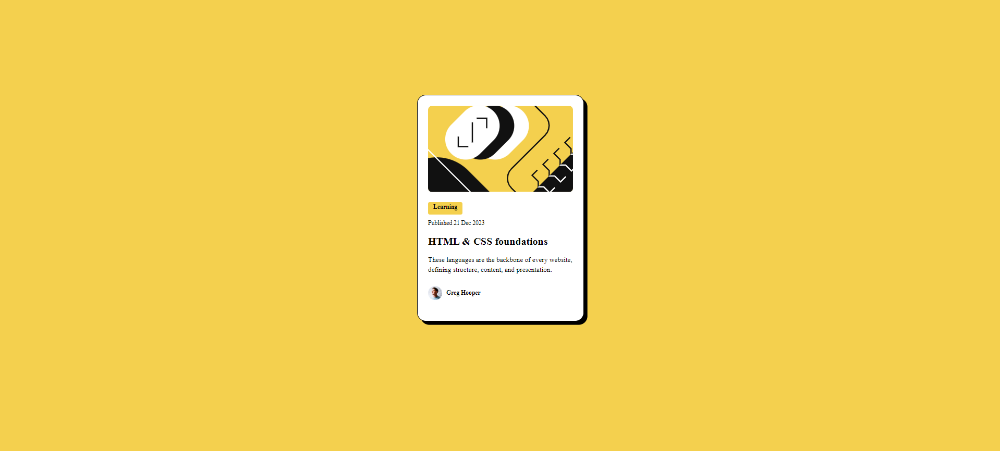

# Frontend Mentor - Solução de cartão de visualização de blog

Esta é uma solução para o desafio do cartão de visualização do blog no Frontend Mentor, no qual tive desafios e com dedicação e esforço consegui superar, espero que gostem do resultado, estou aberto a sugestões de melhorias. 

## Visão geral

- [Solução e código](https://github.com/munizz-g/blog-preview-card-main)
- [Site ativo](https://munizz-g.github.io/blog-preview-card-main/)

## Meu processo

1 - Análise do Design: Estudei cuidadosamente o design fornecido, observando os elementos, cores, fontes e layout. Compreendi a estrutura geral do cartão.

2 - Estrutura HTML: Comecei criando a estrutura básica do HTML. Defini as seções principais, como o título do blog, a imagem do autor e a descrição.

3 - Estilização CSS:
- Utilizei CSS para estilizar cada elemento do cartão.
- Apliquei flexbox para posicionar os elementos corretamente.
- Defini cores, fontes e espaçamentos de acordo com o design.
- Tornei o cartão responsivo usando media queries para ajustar o layout em diferentes tamanhos de tela.

4 - Testes e Ajustes:
Testei a solução em dispositivos móveis, tablets e desktops.
Verifiquei se todos os elementos estavam alinhados corretamente e se a aparência era consistente.

5 - Documentação:
Escrevi este README para explicar minha solução, incluindo capturas de tela e links relevantes.
Compartilhei meu código no GitHub para que outros desenvolvedores possam ver e aprender com ele.

## Construído com

- Marcação HTML5 semântica
- Propriedades personalizadas CSS
- Flexbox e técnicas delayout responsivo
- Fluxo de trabalho voltado para dispositivos móveis

## O que eu aprendi

Trabalhar com media queries durante este desafio me proporcionou insights valiosos sobre a criação de layouts responsivos. Aqui estão algumas das lições que aprendi:

- Compreensão das necessidades dos dispositivos: Ao aplicar media queries, precisei considerar as diferentes necessidades dos dispositivos, como smartphones, tablets e desktops. Isso me ajudou a projetar layouts que se adaptam bem a cada tela.

- Pontos de Interrupção Estratégicos: Identificar os pontos de interrupção (breakpoints) corretos foi fundamental. Ajustar o design em tamanhos específicos de tela permitiu que eu otimizasse a experiência do usuário.

- Flexibilidade e Adaptabilidade: As media queries me ensinaram a criar designs flexíveis e adaptáveis. A capacidade de ajustar o layout com base no tamanho da tela é uma habilidade valiosa.
Para ver como você pode adicionar trechos de código, veja abaixo:

## Desenvolvimento contínuo

Continuar me aprofundando nos estudos em responsividade e explorar as capacidades do Flexbox são os próximos passos que irei seguir. Em seguida pretendo aprender a trabalhar com Grid, para então poder melhorar o meu desempenho na criação de páginas nas quais poderei aplicar não somente o Grid, mas também o flexbox e a responsividade em conjunto. Habilidades que são essenciais para se tornar um desenvolvedor web mais habilidoso. 

## Autor

- Perfil do Frontend Mentor - [@munizz-g](https://www.frontendmentor.io/profile/munizz-g)
- Linkedin - [Lucas Muniz](https://www.linkedin.com/in/lucas-muniz-gomes-36bba0298/)

## Agradecimentos

Agradeço ao meu colega de curso [Lucas Jones](https://www.linkedin.com/in/lucasjcfreire/) que tem me auxiliado muito com dicas de melhoria de código, e em especial nesse desafio com a responsividade, ensinamentos valiosos que carregarei em toda minha carreira Dev. 
